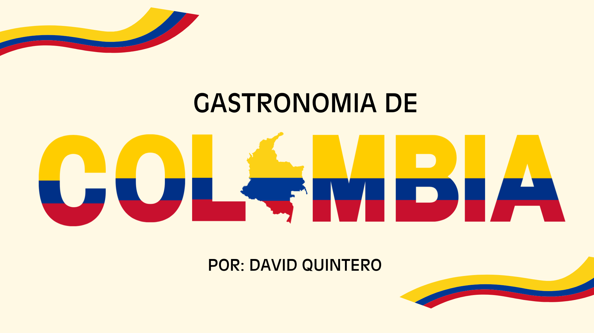

---

## 🚀 Sobre mí  
✨ Soy un **apasionado de la programación web**, siempre aprendiendo y buscando nuevas formas de mejorar.  
💡 Me encanta crear proyectos que mezclen **creatividad, diseño y tecnología**.  
🎯 Objetivo: crecer como **desarrollador fullstack** y aportar soluciones digitales que inspiren.  

---

## 🛠️ Habilidades  

  
  
  
  
  

---

## 🏢 Nuevo Proyecto: Nuva S.A.S

  

✨ Una **landing page moderna y profesional** desarrollada para **Nuva S.A.S**, destacando su marca y servicios con un diseño limpio, corporativo y responsivo.  

🔗 **Demo:** [Ver Proyecto](https://3145434864c-prog.github.io/Nuva-landigpage/)  
📂 **Repositorio:** [GitHub Repo](https://github.com/3145434864c-prog/3145434864c-prog.git)

---

## 🐾 Proyecto: Huellitas Alegres  

  

💖 Una página web pensada para el **cuidado y bienestar de las mascotas**.  

🔗 **Demo:** [Ver Proyecto](https://3145434864c-prog.github.io/Pagina-Veterinaria/)  
📂 **Repositorio:** [GitHub Repo](https://github.com/3145434864c-prog/Pagina-Veterinaria)

---

## 🍽️ Proyecto destacado: Comidas Colombianas  

  

Un sitio web dedicado a la **gastronomía típica de Colombia** 🇨🇴🍲  

🔗 **Demo:** [Ver Proyecto](https://3145434864c-prog.github.io/comidas-colombianas/)  
📂 **Repositorio:** [GitHub Repo](https://github.com/3145434864c-prog/comidas-colombianas)

---

## 📂 Portafolio de Proyectos  

| Proyecto | Descripción | Demo | Repositorio |
|:--------:|:-----------:|:----:|:-----------:|
| 🏢 **Landing Page – Nuva S.A.S** | Página corporativa moderna y responsiva 🌐 | [🔗 Demo](https://3145434864c-prog.github.io/Nuva-landigpage/) | [📂 Repo](https://github.com/3145434864c-prog/3145434864c-prog.git) |
| 🐾 **Huellitas Alegres** | Web sobre cuidado y bienestar de mascotas 🐶🐱 | [🔗 Demo](https://3145434864c-prog.github.io/Pagina-Veterinaria/) | [📂 Repo](https://github.com/3145434864c-prog/Pagina-Veterinaria) |
| 🍽️ **Comidas Colombianas** | Gastronomía típica de Colombia 🇨🇴 | [🔗 Demo](https://3145434864c-prog.github.io/comidas-colombianas/) | [📂 Repo](https://github.com/3145434864c-prog/comidas-colombianas) |
| 🎲 **Memory Master** | Juego de memoria con cartas interactivas 🧠 | [🔗 Demo](https://3145434864c-prog.github.io/Memory-Master-/) | [📂 Repo](https://github.com/3145434864c-prog/Memory-Master-) |
| 🔐 **Juego de Cesar 2.0** | Juego interactivo de lógica y cifrado | [🔗 Demo](https://3145434864c-prog.github.io/juego-de-cesar2.0/) | [📂 Repo](https://github.com/3145434864c-prog/juego-de-cesar2.0) |
| 💌 **Carta para ti** | Carta digital interactiva 💖 | [🔗 Demo](https://3145434864c-prog.github.io/carta_para_ti/) | [📂 Repo](https://github.com/3145434864c-prog/carta_para_ti) |
| 🎬 **Recomendar Cine** | Web simple para recomendar películas 🍿 | [🔗 Demo](https://3145434864c-prog.github.io/Recomendar-cine/) | [📂 Repo](https://github.com/3145434864c-prog/Recomendar-cine) |

---

## 📊 Estadísticas  

  
  

---

## 📫 Contacto  

✨ **Sé parte de esta aventura digital 🚀**  
Gracias por visitar mi perfil 🙌  

  
  

