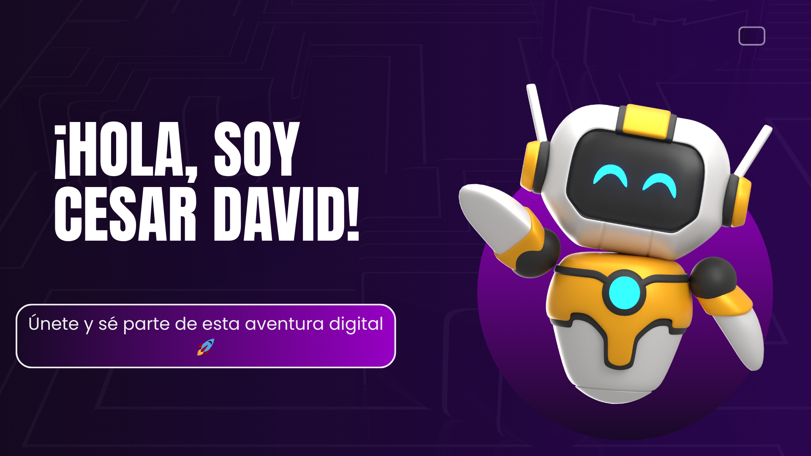
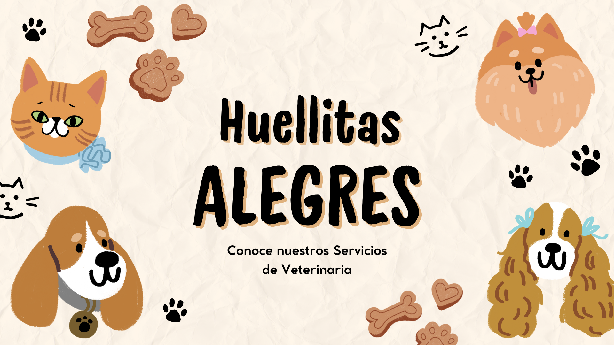

---

# 👋 ¡Hola!   
Soy un desarrollador Fullstack en crecimiento, con experiencia construyendo soluciones modernas orientadas a calidad, seguridad y escalabilidad. Combino creatividad, diseño y buenas prácticas para desarrollar productos digitales eficaces.

Me apasiona crear herramientas que resuelvan problemas reales, desde software empresarial hasta aplicaciones web completas.

---

# 🛠️ Habilidades Técnicas

  
  
  
  
  
  
  
  

---

# 🎓 Certificaciones 
He completado formación en IA, programación y seguridad, destacando:

- **Generative AI: Prompt Engineering Basics**  
- **Foundations of Cybersecurity**  
- **Introduction to Artificial Intelligence (AI)**  
- **Python for Data Science, AI & Development**  
- **Developing AI Applications with Python and Flask**  
- **Data, Data Everywhere**  
- **Cómo resolver problemas y tomar decisiones con eficacia**  
- **Generative AI: Introduction and Applications**
- **Manejo de herramientas para codificacion de software**

---

# 🧑‍💼 Experiencia como Líder de Proyectos
He trabajado dirigiendo iniciativas tecnológicas, organizando equipos, gestionando entregables y asegurando que cada producto mantenga calidad, claridad técnica y escalabilidad.  
Estas habilidades fortalecen mi enfoque al construir software eficiente, mantenible y bien estructurado.

---

## 🏢 Nuevo Proyecto: Nuva S.A.S

  

✨ Una **landing page moderna y profesional** desarrollada para **Nuva S.A.S**, destacando su marca y servicios con un diseño limpio, corporativo y responsivo.  

🔗 **Demo:** [Ver Proyecto](https://3145434864c-prog.github.io/Nuva-landigpage/)  
📂 **Repositorio:** [GitHub Repo](https://github.com/3145434864c-prog/Nuva-landigpage)

---

## 🐾 Proyecto: Huellitas Alegres  

  

💖 Una página web pensada para el **cuidado y bienestar de las mascotas**.  

🔗 **Demo:** [Ver Proyecto](https://3145434864c-prog.github.io/Pagina-Veterinaria/)  
📂 **Repositorio:** [GitHub Repo](https://github.com/3145434864c-prog/Nuva-landigpage)

---

## 🍽️ Proyecto destacado: Comidas Colombianas  

  

Un sitio web dedicado a la **gastronomía típica de Colombia** 🇨🇴🍲 

🔗 **Demo:** [Ver Proyecto](https://3145434864c-prog.github.io/comidas-colombianas/)  
📂 **Repositorio:** [GitHub Repo](https://github.com/3145434864c-prog/comidas-colombianas)

---

## 🚀 Proyectos Profesionales

### 💼 Finanzas Personales  

  <h3 style="margin: 0; font-size: 22px;">📘 Laravel 12 + Filament</h3>
  

    Plataforma de gestión financiera completa: ingresos, gastos, reportes, categorías y panel administrativo moderno.
  

  <a href="https://github.com/3145434864c-prog/finanzasPersonales.git">
    🔗 <strong>Ver repositorio</strong>
  </a>

---
### 🏭 2FA – Gestión de Inventarios  

  <h3 style="margin: 0; font-size: 22px;">🔐 Sistema Empresarial</h3>
  

    Sistema creado para <strong>Nuva S.A.S</strong>. Seguridad reforzada, base escalable y flujo de inventarios estable.
  

  <a href="https://github.com/3145434864c-prog/2FA.git">
    🔗 <strong>Ver repositorio</strong>
  </a>

---

### 🔌 API REST – PHP 8  

  <h3 style="margin: 0; font-size: 22px;">🌐 Backend Modular</h3>
  

    API ligera y organizada con <strong>PHP 8</strong>. Estructura clara, endpoints estandarizados y alta integrabilidad.
  

  <a href="https://github.com/3145434864c-prog/Api.git">
    🔗 <strong>Ver repositorio</strong>
  </a>

---

## 📂 Portafolio de Proyectos  

| Proyecto | Descripción | Demo | Repositorio |
|:--------:|:-----------:|:----:|:-----------:|
| 🏢 **Landing Page – Nuva S.A.S** | Página corporativa moderna y responsiva 🌐 | [🔗 Demo](https://3145434864c-prog.github.io/Nuva-landigpage/) | [📂 Repo](https://github.com/3145434864c-prog/3145434864c-prog.git) |
| 🐾 **Huellitas Alegres** | Web sobre cuidado y bienestar de mascotas 🐶🐱 | [🔗 Demo](https://3145434864c-prog.github.io/Pagina-Veterinaria/) | [📂 Repo](https://github.com/3145434864c-prog/Pagina-Veterinaria) |
| 🍽️ **Comidas Colombianas** | Gastronomía típica de Colombia 🇨🇴 | [🔗 Demo](https://3145434864c-prog.github.io/comidas-colombianas/) | [📂 Repo](https://github.com/3145434864c-prog/comidas-colombianas) |
| 🎲 **Memory Master** | Juego de memoria con cartas interactivas 🧠 | [🔗 Demo](https://3145434864c-prog.github.io/Memory-Master-/) | [📂 Repo](https://github.com/3145434864c-prog/Memory-Master-) |
| 🔐 **Juego de Cesar 2.0** | Juego interactivo de lógica y cifrado | [🔗 Demo](https://3145434864c-prog.github.io/juego-de-cesar2.0/) | [📂 Repo](https://github.com/3145434864c-prog/juego-de-cesar2.0) |
| 💌 **Carta para ti** | Carta digital interactiva 💖 | [🔗 Demo](https://3145434864c-prog.github.io/carta_para_ti/) | [📂 Repo](https://github.com/3145434864c-prog/carta_para_ti) |
| 🎬 **Recomendar Cine** | Web simple para recomendar películas 🍿 | [🔗 Demo](https://3145434864c-prog.github.io/Recomendar-cine/) | [📂 Repo](https://github.com/3145434864c-prog/Recomendar-cine) |

---

  <!-- Título Animado -->
  <h2 style="
    font-size: 42px;
    font-weight: 900;
    background: linear-gradient(90deg, #0A66C2, #00AEEF, #0077FF);
    -webkit-background-clip: text;
    color: transparent;
    animation: glow 2.5s ease-in-out infinite alternate;
    letter-spacing: 1.5px;
    margin-bottom: 10px;
  ">
    ¡Construyamos algo extraordinario! 🚀
  </h2>

  <!-- Descripción -->
  

    Gracias por visitar mi perfil. Si deseas colaborar, crear, aprender o hablar de tecnología, aquí estoy.  
    Siempre abierto a nuevos retos y proyectos con impacto real.
  

   

  <!-- Botones -->
  

  

